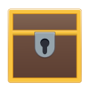

    

<h1 align="center">Lock Box</h1>

    

## Lock your secrets up tight

Keep your notes and website logins secure in an easy to manage collection. It is ready to go when you're logged in, and securely encrypted when you're not.

### Features
- Fast search
- Sort by name or date added
- Access to logins saved in Epiphany

## Developing and Building

You'll need the following dependencies:
* meson
* libgranite-dev
* libsecret-1-dev
* libvala-0.34-dev (or higher)
* valac

Run `meson build` to configure the build environment. Change to the build directory and run `ninja` to build

    meson build --prefix=/usr
    cd build
    ninja

To install, use `ninja install`, then execute with `com.github.skarva.lockbox`

    sudo ninja install
    com.github.skarva.lockbox
